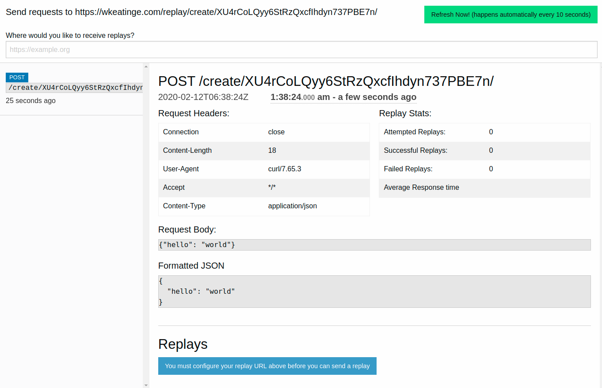
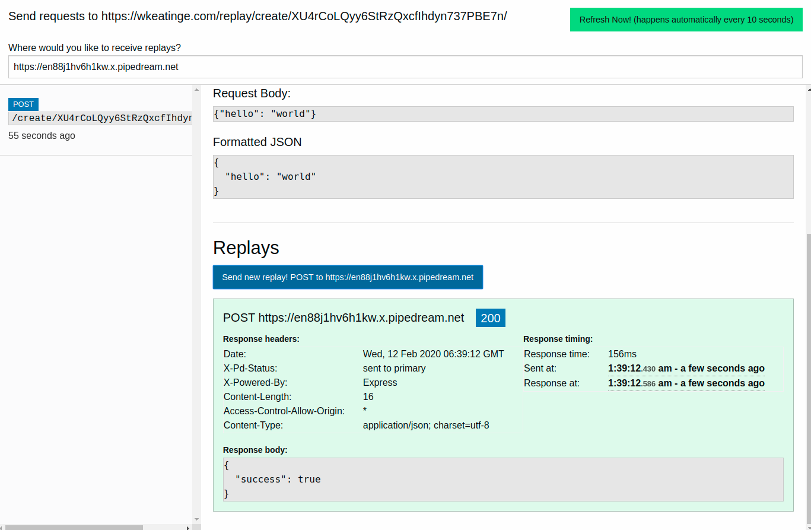

# What is webhook-replay?
In an nutshell, it's like requestbin but allows you to replay incoming requests,
sending them to a url of your choosing. Webhook-replay is a project built to make it easier to develop and test webhooks with
services that don't allow you to send test requests.

The idea is that developers would use the following workflow:
1. Visit https://wkeatinge.com/replay and get a custom url
1. Configure the webhook service (Github, Hubspot, etc) to send webhook requests to the custom URL
1. Do the action in the service (Github, Hubspot, etc) that triggers the webhook to be sent
1. The webhook headers and body can now be inspected in the web app
1. The developer configures their replay URL to point a server they control (or use a [ngrok](https://ngrok.com) url for development on localhost)
1. They can replay the exact request to test how their application would perform if it had received the webhook.


The project is essentially an extension of tools like the ones listed below, with the additional ability to replay 
captured requests on a url of your choosing.
1. https://requestbin.com/
2. http://requestbin.net/
3. https://httpbin.org/
4. https://webhook.site/

# Example walkthrough
- Go to https://wkeatinge.com/replay/, an account is automatically created for you, storing
a unique id in your browser's cookies. You can delete the cookie to drop all your existing state.
- At the top you should see text that says 'Send requests to <url>'. Copy the URL and send a request to it.
For example, if your custom url was: 
`
https://wkeatinge.com/replay/create/XU4rCoLQyy6StRzQxcfIhdyn737PBE7n/
`,
you could send the following request


```
curl --header 'Content-Type: application/json' \
     --request POST \
     --data '{"hello": "world"}' \
     https://wkeatinge.com/replay/create/XU4rCoLQyy6StRzQxcfIhdyn737PBE7n/
```

***NOTE: Don't forget to replace the URL with your custom url***

- After 10 seconds, you should see the request in the web page (you can also click the green refresh button on the top right):



- This replicates the functionality of requestbin and similiar websites, but now it is possible 
to *replay* this request, to send this exact request to a different url

- Usually you would choose your own web server to recieve replays, but for demonstration purposes
we can send the replays to a site like requestbin. Visit https://requestbin.com and create a private bin.
Paste the endpoint url into the textbook on the top of wkeatinge.com/replay

- Click the blue button at the bottom that says "Send new replay" to send that same `{"hello": "world"}`
request to requestbin.


- From within requestbin you can see the request was indeed sent, and from
https://wkeatinge.com/replay you can see requestbin's response to this request

- For fun, you can try setting your your replay receive url (the textbox) to
your send request url (at the very top). You should see a new replay and a new 
incoming request.
