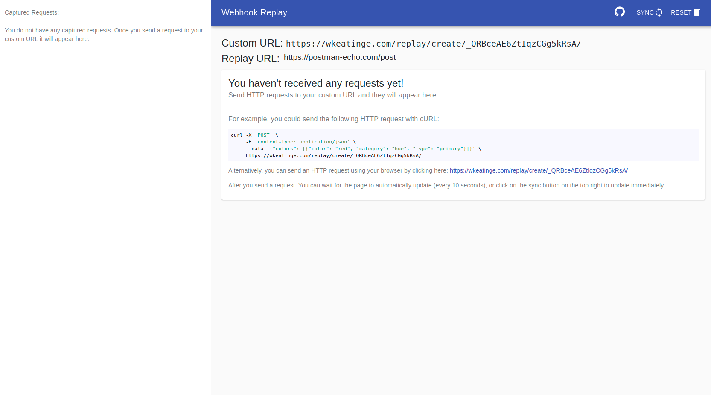
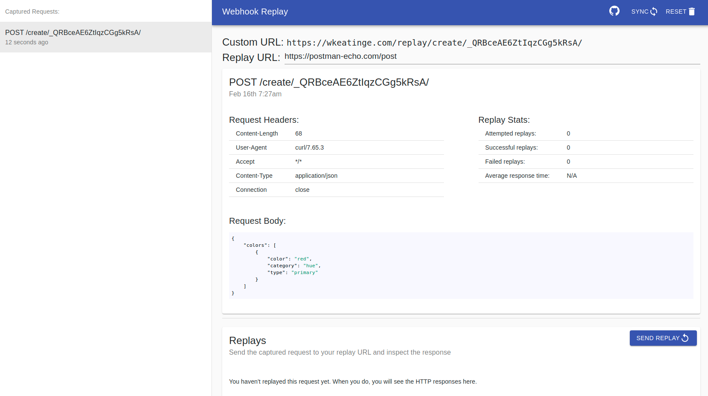
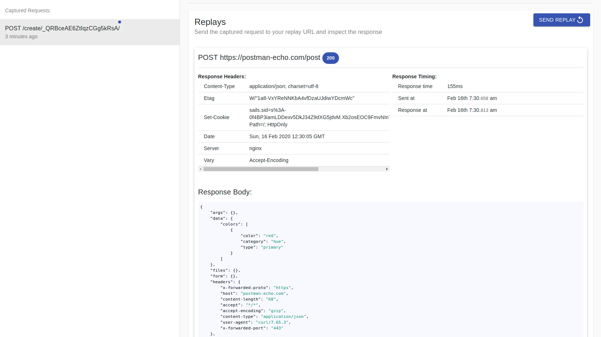

# What is webhook-replay?
Webhook-replay is a project built to make it easier to develop and test webhooks with
services that don't allow you to send test requests.
In a nutshell, it's like https://requestbin.com but also allows you to replay incoming requests,
sending them to a url of your choosing. 

The idea is that developers would use the following workflow:
1. Visit https://wkeatinge.com/replay and get a custom url
1. Configure the webhook service (Github, Hubspot, etc) to send webhook requests to the custom URL
1. Do the action in the service (Github, Hubspot, etc) that triggers the webhook to be sent
1. The webhook method, url, headers, and body can now be inspected at https://wkeatinge.com/replay
1. The developer configures their replay URL to point a server they control (or use a [ngrok](https://ngrok.com) url for development on localhost)
1. The developer can now replay the exact request as many times as needed to test how their application would perform if it had received the webhook request.


The project is essentially an extension of tools like the ones listed below, with the additional ability to replay 
captured requests on a url of your choosing.
1. https://requestbin.com/
2. http://requestbin.net/
3. https://httpbin.org/
4. https://webhook.site/

# Running locally with Docker
```bash
git clone https://github.com/keatinge/webhook-replay.git
cd webhook-replay
docker build . -t 'whreplay:latest' # This will take a while on the first build
docker run -p 5000:5000 -e dev=true
```
You should now be able to see the web server at http://localhost:5000


# Example walkthrough
- Go to https://wkeatinge.com/replay/, an account is automatically created for you, storing
a unique id in your browser's cookies. Here's what the page should look like:


- At the top you should see a custom URL that looks like `https://wkeatinge.com/replay/create/.../`. 
Any requests sent to this URL will be visible in the web client.
- For example, you could send the following request (which you can copy and paste from code block displayed on https://wkeatinge.com/replay)

```
curl -X 'POST' \
     -H 'content-type: application/json' \
     --data '{"colors": [{"color": "red", "category": "hue", "type": "primary"}]}' \
     https://wkeatinge.com/replay/create/YOUR_UNIQUE_ID_HERE/
```

***NOTE: If you copy and paste the request from here (the README) you will need to change the URL to your "Custom URL"***

- Once you sent the request, click the sync button in the top right to synchronize the server with the web client so that you
can see your captured request. Requests and replays are automatically synchronized every 10 seconds, but you can always force a sync by
clicking the sync button.

- Now you should see your request in the sidebar and in the main panel.


- This replicates the functionality of requestbin and similiar websites, but now it is also possible 
to *replay* this request, to send this exact request to a different url

- Usually you would choose your own web server (or an ngrok url for development on localhost) to receive replays, but for demonstration purposes
we can send the replays to the [Postman Echo API](https://postman-echo.com/?source=echo-collection-app-onboarding). Postman Echo
simply responds to HTTP requests with some JSON describing the request that was received.

- At the top of https://wkeatinge.com/replay paste the URL: `https://postman-echo.com/post` into the
textbox labeled "Replay URL".


- Click the blue button at the bottom that says "Send new replay" to send that same colors json
request to the Postman Echo API.

- From within https://wkeatinge.com/replay you can see the request was indeed sent, and you can see
the Echo API's response.



# The Tech Stack
## Backend
1. Rest API is written in Golang using the [Echo](https://echo.labstack.com/) framework.
1. The database is SQLite, but may change to Postgres at some point. SQLite is nice here
because it makes it very easy to run locally, for example as a self-contained docker image.
Switching to Postgres will require running using docker-compose.
1. See the `backend` directory for the implementation
## Frontend
1. The frontend is written in React using the excellent [Material UI](https://material-ui.com/) component library.
1. [react-highlight.js](https://github.com/bvaughn/react-highlight.js) (which uses highlight.js) is used for highlighting JSON response bodies and bash snippets (for cURL requests)
1. [axios](https://github.com/axios/axios) is used for HTTP requests.
1. [notistack](https://github.com/iamhosseindhv/notistack) is used for success/error/info alerts.
1. See `whfrontend/src` for the implementation
## Deployment
1. https://webhook-replay.com is deployed to Google's Compute Engine.
1. On the server docker-compose runs a prebuilt docker image (saved as a tar)
    - The golang web server exposes port 5000
    - The SQLite database is mounted as a volume
    - Auto restarts are enabled
1. The docker image uses two multi-stage builds. One to build the backend and one to build the frontend. The final image is based on Alpine linux and comes in at a decent `34.3MB`. (It was nearly `1GB` before the multi-stage builds! Mostly because of `node_modules`)
1. On the server NGINX runs as a reverse proxy to the Golang server on port 5000
1. The SSL certificate was generated using [Lets Encrypt](https://letsencrypt.org/)
1. See `Dockerfile`, `docker-compose.yml`, `scripts/configure_server.sh`, `scipts/deploy.sh`, and `scripts/deploy_server_side.sh` for some of the relevant files.


# REST API Documentation
#### POST `/register`
This endpoint allows you to register with webhook-replay, giving you access to a custom url.
Send an empty POST request to `/register` to receive an `ident`, which you can then use with `/create/:ident/*` request.
```bash
$ curl -X 'POST' https://wkeatinge.com/replay/register 2>/dev/null | jq
{
  "ident": "LnAemHFabieH0JQOJ55UAA"
}
```
- This endpoint will return `500: Internal Server Error` if there are issues with the database, with a string `error` as described in `/create/:ident/*`

#### ANY `/create/:ident/*`
This endpoint saves all incoming requests in the database. Any headers, body, and url suffix will
be accepted (as long as it's within the NGINX maximum size).

```
$ curl -X 'POST' https://wkeatinge.com/replay/create/LnAemHFabieH0JQOJ55UAA/123 --data 'test data' 2>/dev/null | jq
{
  "created_id": 52,
  "success": true,
  "error": null
}
```

- This endpoint will return `400: Bad Request` if the identity, `:ident` does not match an existing identity (created with `/register`)
- This endpoint will return `500: Internal Server Error` if there are issues writing the request to the database
- If success is true, the response will include a `created_id` and `error` will be set to `null`
- In the error cases, the `error` value will be set to a human-readable string describing what went wrong.


#### GET `/requests`
This endpoint returns the 50 most recent received requests at your endpoint. Your `ident`
should be specified in a cookie as shown below

```bash
$ curl -X 'GET' https://wkeatinge.com/replay/requests --cookie 'ident=LnAemHFabieH0JQOJ55UAA' 2>/dev/null | jq
[
  {
    "id": 52,
    "meth": "POST",
    "loc": "/create/LnAemHFabieH0JQOJ55UAA/123",
    "body": "test data",
    "headers": [
      {
        "Key": "Content-Type",
        "Value": "application/x-www-form-urlencoded"
      },
      {
        "Key": "Connection",
        "Value": "close"
      },
      {
        "Key": "Content-Length",
        "Value": "9"
      },
      {
        "Key": "User-Agent",
        "Value": "curl/7.65.3"
      },
      {
        "Key": "Accept",
        "Value": "*/*"
      }
    ],
    "time": "2020-02-16T12:49:10Z",
    "replays": []
  }
]
```
- Returns `400: Bad Request` for an invalid ident
- Returns `500 Internal Server Error` for database issues

#### POST `/replay`
This endpoint creates a new replay of a captured request at a desired URL.
The request body be JSON and should contain a `request_id` and an `endpoint`.
```json
{
    "request_id": 51,
    "endpoint": "https://postman-echo.com/post"
}
```

```bash
$ curl -X 'POST' --cookie 'ident=LnAemHFabieH0JQOJ55UAA' --data '{"request_id": 52, "endpoint": "htt
ps://postman-echo.com/post"}' --header 'Content-Type: application/json' https://wkeatinge.com/replay/repl
ay 2>/dev/null | jq
{
  "replay_id": 58
}
```
- Returns `429: Too Many Requests` if you have sent too many replays recently.
- Returns `400: Bad Request` for issues with `ident`, the request body, the endpoint not being valid,
or the request id not being valid.
- Returns `500: Internal Server Error` for database issues
- Returns `200: OK` when the request is sent and a response is received. That response may be a 400, 500, etc. A `200` response
from the webhook-replay server does not indicate a `200` response from the supplied endpoint.
A `200` response only means the request was sent and responded to.

